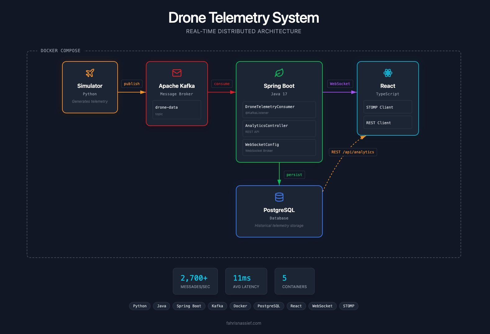

#  Drone Telemetry System

A real-time distributed system that ingests drone telemetry data via Kafka, persists to PostgreSQL, and streams live updates to a React dashboard over WebSockets.

---

## 📖 Overview

- **Simulation**: Python spawns and simulates multiple drone objects
- **Streaming**: Each drone writes telemetry (location, altitude, speed, battery, etc.) to a Kafka topic
- **Persistence**: Spring Boot consumes from Kafka and stores telemetry in PostgreSQL
- **Real-time**: WebSocket broadcasting pushes live updates to connected clients
- **Frontend**: React dashboard displays real-time telemetry and historical data via REST
- **Deployment**: All services run in Docker containers

  

---

## ⚙️ Tech Stack

- `Python`
- `Java`
- `Apache Kafka`
- `Spring Boot`
- `PostgreSQL`
- `React`
- `TypeScript`
- `WebSocket (STOMP)`
- `Docker`

---

## 📊 Performance

- **2,700+** messages/second throughput
- **11ms** average latency
- **5** containerized services

---

## 🎯 Purpose

- Explore event-driven architecture and real-time data streaming
- Gain hands-on experience with containerization and service orchestration
- Build a full-stack distributed system from simulation to visualization

