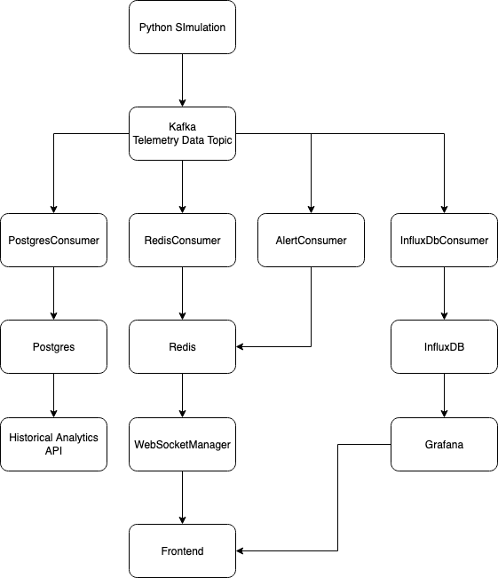

#  Drone Telemetry System

A simulated drone telemetry platform that generates real-time drone data, streams it via Kafka, and stores it for historical analysis.  
This project demonstrates event-driven architecture, containerized deployment, and integration across multiple backend technologies.

---

## 📖 Overview

- **Simulation**: Python spawns and simulates multiple drone objects.  
- **Streaming**: Each drone writes telemetry (location, altitude, speed, battery, etc.) to a Kafka topic every second.  
- **Persistence**: A Spring Boot backend consumes messages from Kafka and stores telemetry data in Postgres for long-term historical storage.  
- **Deployment**: All services run in Docker, communicating over the same Docker network.

---

## 🛠️ Planned Architecture

The long-term vision of this project expands beyond the current pipeline (Python → Kafka → Spring Boot → Postgres) into a full telemetry and analytics ecosystem.  

Key planned components:  
- **PostgresConsumer** → Persists telemetry for historical storage and analytics.  
- **Historical Analytics API** → Queryable endpoints for long-term data insights.  
- **RedisConsumer + WebSocketManager** → Streams real-time drone locations to the frontend.  
- **InfluxDBConsumer + Grafana** → Time-series dashboards per drone (speed, altitude, battery).  
- **AlertConsumer** → Real-time alerts feeding into Redis and the frontend.  
- **Frontend (React + Vite)** → Interactive UI combining live tracking, dashboards, and analytics.  

  

---

## ⚙️ Tech Stack

- **Python** – Drone simulation & Kafka producer  
- **Apache Kafka** – Message broker for telemetry events  
- **Spring Boot** – Backend consumer & API development  
- **Postgres** – Historical data storage  
- **Docker & Docker Compose** – Containerized deployment and networking  

---

## 🚀 Planned Enhancements

- **Analytics API** – Spring Boot endpoints to query historical telemetry data.  
- **Frontend (React + Vite)** – Interactive UI for telemetry and analytics.  
- **Real-Time Tracking** – Kafka → Redis consumer feeding a WebSocket manager to stream live drone locations on a map.  
- **Grafana Dashboards** – InfluxDB consumer generating per-drone dashboards (speed, altitude, battery trends).  
- **Automation & Deployment** – VM setup with VirtualBox/Hyper-V + Ansible playbook for automated deployment of `docker-compose.yml`.  

---

## 🎯 Purpose

This project is being developed to:  
- Explore event-driven microservices architecture and real-time telemetry streaming.  
- Gain practical experience with containerization and service orchestration using Docker and Docker Compose.  
- Demonstrate deployment automation and systems integration through the use of virtual machines and Ansible.  
- Create a comprehensive project that highlights both software engineering and infrastructure skills in a real-world context.   

---

## 📌 Status

🔧 **Active development** – Currently simulating drones, streaming via Kafka, and persisting to Postgres.  
Shifting focus next to virtual machine deployment and Ansible automation, with analytics, frontend, and dashboards planned for later.  

---
