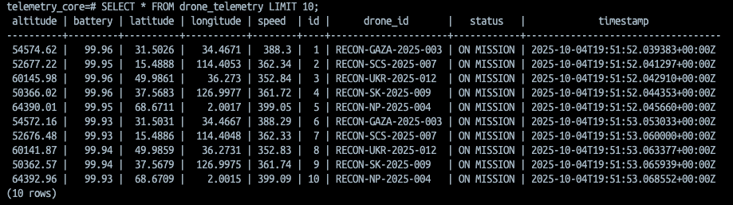

#  Drone Telemetry System

**Backend & Database:**  
     

**Deployment & Infrastructure:**  
     

A simulated drone telemetry platform that generates real-time drone data, streams it via Kafka, and stores it for historical analysis.  
This project demonstrates event-driven architecture, containerized deployment, and integration across multiple backend technologies.

---

## 📖 Overview

- **Simulation**: Python spawns and simulates multiple drone objects.  
- **Streaming**: Each drone writes telemetry (location, altitude, speed, battery, etc.) to a Kafka topic every second.  
- **Persistence**: A Spring Boot backend consumes messages from Kafka and stores telemetry data in Postgres for long-term historical storage.  
- **Deployment**: All services run in Docker containers, deployed on an Ubuntu VM with automated setup and configuration handled by Ansible.

  

  *Sample telemetry data stored in Postgres.*

---

## ⚙️ Tech Stack

- **Python** – Drone simulation & Kafka producer  
- **Apache Kafka** – Message broker for telemetry events  
- **Spring Boot** – Backend consumer & API development  
- **Postgres** – Historical data storage  
- **Docker & Docker Compose** – Containerized deployment and networking
- **VMware + Ubuntu 24 ARM** – Virtualized deployment environment
- **Ansible** - Configuration and application deployment

---

## 🛠️ Planned Architecture

The long-term vision of this project expands beyond the current pipeline (Python → Kafka → Spring Boot → Postgres) into a full telemetry and analytics ecosystem.  

Key planned components:   
- **Historical Analytics API** → Queryable endpoints for long-term data insights.  
- **RedisConsumer + WebSocketManager** → Streams real-time drone locations to the frontend.  
- **InfluxDBConsumer + Grafana** → Time-series dashboards per drone (speed, altitude, battery).  
- **AlertConsumer** → Real-time alerts feeding into Redis and the frontend.  
- **Frontend (React + Vite)** → Interactive UI combining live tracking, dashboards, and analytics.  

  

---

# ✅ Deployment Automation (Achieved)

The deployment pipeline is fully functional and automated.  
This project is running on a remote **Ubuntu 24 ARM VM**, configured and deployed entirely via **Ansible**.

The playbook handles all necessary setup, including:
- Deep volume cleanup  
- Correct secret injection  
- Successful database initialization  

## 📋 Deployment Verification Matrix

| Component              | Status                                                                 | Verification                                                                 |
|------------------------|------------------------------------------------------------------------|-------------------------------------------------------------------------------|
| **VM Configuration**   | Ubuntu 24 ARM is running Docker and dependencies.                      | ✅ Confirmed                                                                  |
| **Ansible Playbook**   | Successfully automates deployment and configuration.                   | ✅ Confirmed Operational                                                      |
| **Postgres Initialization** | `telemetry_core` database is created, and all application tables are present. | ✅ Confirmed via `docker exec psql -U droneuser -d telemetry_core`            |
| **Application Stack**  | All services (Python Producer, Kafka, Spring Boot Consumer, Postgres) are running and communicating. | ✅ Confirmed                                                                  |

---

## 🎯 Purpose

This project is being developed to:  
- Explore event-driven microservices architecture and real-time telemetry streaming.  
- Gain practical experience with containerization and service orchestration using Docker and Docker Compose.  
- Demonstrate deployment automation and systems integration through the use of virtual machines and Ansible.  
- Create a comprehensive project that highlights both software engineering and infrastructure skills in a real-world context.   

---

## 📌 Status

🔧 **Active development** – Currently simulating drones, streaming via Kafka, and persisting to Postgres.
Deployment automation with Ubuntu VM + Ansible is complete. Focus is shifting to analytics, frontend, and dashboards.

---
